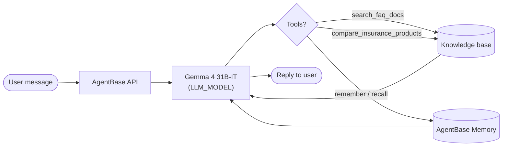
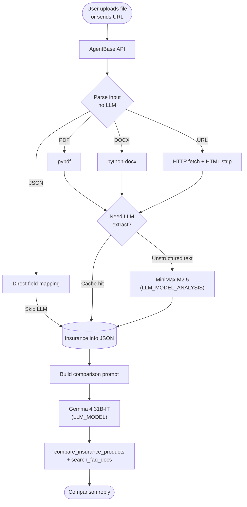

# Flowy — Multi-Partner Insurance FAQ Chatbot

A multi-partner insurance advisory agent with a chat interface, file upload, and product comparison. Built on the [GreenNode AgentBase](https://docs.vngcloud.vn/agentbase) platform for Zalopay insurance products.

> **Knowledge preparation:** Need to import FAQ from PDF/DOCX into this repo? Use **[Flowy Prepare](https://github.com/thangtmc73/flowy-prepare)** — a companion web app (experimental) that uses AI to extract, review, and export structured JSON for Flowy's `knowledge/` folder. Flowy Prepare handles authoring; **this repo** runs the chatbot agent.

> **Disclaimer:** This project was developed for the [GreenNode Claw-a-thon](https://greennode.ai/events/greennode-claw-a-thon) hackathon. Platform resources (LLM access, AgentBase runtime, memory, container registry, etc.) are provided for the event and **may be revoked after the hackathon ends**. Insurance product details, benefits, premiums, and policies in the knowledge base **may become outdated over time** and are for reference only — always verify with the official insurer or Zalopay before making decisions.

## Team

TramNTQ, ThangTM2, TranVHD

## LLM Models

Flowy uses **two models** from the same GreenNode AI Platform API key (`LLM_BASE_URL` + `LLM_API_KEY`). Each model handles a different part of the pipeline.

### Models in use (default config)

| Role | Env variable | Default model | Path | Used for |
|------|--------------|---------------|------|----------|
| **Chat agent** | `LLM_MODEL` | Gemma 4 31B-IT | `google/gemma-4-31b-it` | FAQ replies, tool-calling, product comparison answers, multi-turn chat |
| **Document analysis** | `LLM_MODEL_ANALYSIS` | MiniMax M2.5 | `minimax/minimax-m2.5` | Extract structured JSON from uploaded files and external links (when input is unstructured text) |

Both models share the same OpenAI-compatible endpoint. Configure in `.env`:

```env
LLM_MODEL=google/gemma-4-31b-it
LLM_MODEL_ANALYSIS=minimax/minimax-m2.5
```

Get your API key and base URL from the [Model Browser](https://aiplatform.console.vngcloud.vn/models).

### Platform alternatives (optional)

These models are available on the GreenNode AI Platform but **not used by default** in Flowy:

| Model | Path | When to consider |
|-------|------|------------------|
| Qwen 3.5 27B | `qwen/qwen3-5-27b` | Replace `LLM_MODEL` if you need stronger reasoning for complex FAQ (higher latency) |

> **Note:** Keep MiniMax (or a similar model) as `LLM_MODEL_ANALYSIS` for document parsing. Qwen is not recommended for the extraction step.

### Request flow & model interaction

#### Flow 1 — FAQ chat (most requests)

No analysis model involved. Gemma handles the full conversation.



#### Flow 2 — File upload or external link

Code parses the document first. MiniMax runs only when structured extraction via LLM is needed.



#### Summary

| User action | Code (no LLM) | MiniMax | Gemma |
|-------------|---------------|---------|-------|
| Ask FAQ | — | — | ✅ |
| Upload JSON | ✅ map fields | — | ✅ |
| Upload PDF / DOCX / TXT | ✅ parse text | ✅ extract JSON | ✅ |
| Send external link | ✅ fetch page | ✅ extract JSON* | ✅ |
| Re-send same file/link (same session) | ✅ | — (cached) | ✅ |

\* Skipped when the link returns JSON or cache hits.


## Tech Stack

- **Backend**: Python 3.13 + LangChain + LangGraph
- **Frontend**: React 19 + Vite + TailwindCSS
- **LLM**: OpenAI-compatible API (GreenNode AI Platform)
- **Memory**: AgentBase Memory (SEMANTIC strategy)
- **Deployment**: Docker + AgentBase Runtime
- **Knowledge Base**: Multi-partner JSON structure

## Features

### Core Capabilities

- **Multi-Partner Support**: FAQ coverage for MSIG, GIC, VBI, and Bảo Việt insurance products
- **Intelligent Search**: Combines fuzzy matching and LLM tools to find accurate answers
- **Long-term Memory**: Remembers conversation context and user preferences per user
- **Product Comparison**: Compare insurance packages across partners
- **File Upload**: Upload and analyze documents (PDF, JSON, TXT, CSV, Word .docx)
- **Vietnamese Support**: Optimized for Vietnamese language queries

### UI Features

- Modern chat interface with Zalopay branding
- Drag & drop file upload (max 10MB)
- Real-time typing indicators
- Responsive design for mobile and desktop

## Prerequisites

- **Python 3.13+** (or 3.10+)
- **Node.js 24+** (to build the frontend)
- **Docker** (for deployment)
- **GreenNode IAM Service Account** — [Create one here](https://iam.console.vngcloud.vn/service-accounts)

## Quick Start

### 1. Backend Setup

Create a virtual environment and install dependencies:

```bash
python3 -m venv venv
source venv/bin/activate  # Windows: venv\Scripts\activate
pip install -r requirements.txt
```

### 2. Configuration

Copy the example config files:

```bash
cp .env.example .env
cp agentbase.config.example.json agentbase.config.json
```

Configure IAM credentials (choose one option):

- **Option A**: Environment variables

```bash
export GREENNODE_CLIENT_ID="your-client-id"
export GREENNODE_CLIENT_SECRET="your-client-secret"
```

- **Option B**: `.greennode.json` file (recommended for local dev)

```json
{
  "client_id": "your-client-id",
  "client_secret": "your-client-secret"
}
```

### 3. Environment Variables

Edit `.env` with the following values:

| Variable | Description | Example |
|----------|-------------|---------|
| `MEMORY_ID` | Memory store ID on AgentBase | `mem_xxx` |
| `MEMORY_STRATEGY_ID` | Strategy ID for long-term memory | `strat_xxx` |
| `LLM_BASE_URL` | OpenAI-compatible base URL | `https://api.example.com/v1` |
| `LLM_MODEL` | Chat agent model (FAQ, replies) | `google/gemma-4-31b-it` |
| `LLM_MODEL_ANALYSIS` | File/link extraction model | `minimax/minimax-m2.5` |
| `LLM_API_KEY` | LLM API key | `sk-xxx` |
| `EXTRACTION_MAX_CHARS` | Max chars sent to analysis model | `10000` (default) |
| `FAQ_DATA_PATH` | Path to knowledge base | `knowledge` (default) |

> **Note:** On AgentBase Runtime, IAM and Agent Identity are injected automatically. No manual config is needed inside the container.

## Development

### Run Backend

```bash
source venv/bin/activate
python3 main.py
```

Backend API runs at `http://127.0.0.1:8080`

### Run Frontend (Development Mode)

Open a new terminal:

```bash
cd frontend
npm install
npm run dev
```

Frontend dev server runs at `http://localhost:5173`

> **Note:** Set `VITE_API_URL` in `frontend/.env` to point to the backend.

### Testing API

Test the agent with curl:

```bash
curl -X POST http://127.0.0.1:8080/invocations \
  -H "Content-Type: application/json" \
  -H "X-GreenNode-AgentBase-User-Id: test-user" \
  -H "X-GreenNode-AgentBase-Session-Id: test-session-1" \
  -d '{"message": "So sánh gói bảo hiểm sức khỏe MSIG và VBI?"}'
```

Health check:

```bash
curl http://127.0.0.1:8080/health
# Response: {"status":"healthy"}
```

### Required Headers

When using memory, both headers are required:

- `X-GreenNode-AgentBase-User-Id`: Unique user identifier
- `X-GreenNode-AgentBase-Session-Id`: Session/conversation identifier

## Knowledge Base Management

### Structure

The knowledge base uses a multi-partner layout:

```
knowledge/
├── _index.json                         # Partner & product metadata
├── partners/
│   ├── msig_health_247.json            # MSIG Health 24/7
│   ├── gic_credit_topup.json           # GIC Credit Topup
│   ├── vbi_cyber.json                  # VBI Cyber Insurance
│   ├── baoviet_flight_delay_cancel.json # Bảo Việt Flight Delay/Cancel
│   └── TEMPLATE.json                   # Template for new partners
└── cross_product/
    ├── comparisons.json                # Cross-partner comparisons
    └── general_faqs.json               # General Zalopay / platform FAQs
```

### Adding New Partners

**Option 1: Manual (see `knowledge/README.md`)**

1. Create a JSON file under `knowledge/partners/{partner_id}_{product_id}.json`
2. Update `knowledge/_index.json`
3. Validate with the script below

**Option 2: Import from document (CLI)**

```bash
pip install -r requirements-import.txt

python3 scripts/import_partner_docs.py path/to/document.pdf \
  --partner-id new_partner \
  --partner-name "Partner Name" \
  --product-id product_id \
  --product-name "Product Name"
```

See also: [`docs/IMPORT_FROM_DOCS.md`](docs/IMPORT_FROM_DOCS.md)

**Option 3: Flowy Prepare — experimental AI import (recommended for long docs)**

[**Flowy Prepare**](https://github.com/thangtmc73/flowy-prepare) is a separate companion repo with a web UI that uses an **AI agent (LLM)** to parse PDF/DOCX (or edit existing JSON), review FAQ drafts, and download formatted product JSON plus optional shared catalog updates (`_index.json`, cross-product files). Output is designed for this repo's `knowledge/` layout.

> **Experimental:** LLM-generated FAQs need human review before merge. Flowy Prepare does not replace validation — always run `validate_faq.py` and `sync_knowledge.sh` after import.

Workflow: upload document in Flowy Prepare → review/edit → download `{partner_id}_{product_id}.json` → copy into `knowledge/partners/` here → update index if needed → validate & sync below.

Sync knowledge to the frontend after changes:

```bash
bash scripts/sync_knowledge.sh
```

### Validation

Validate FAQ structure before deploy:

```bash
python3 scripts/validate_faq.py knowledge/
```

Expected output:

```
✓ Loaded 150 FAQ entries from 4 partner(s)
✓ Validation passed
```

### Schema Documentation

- **Full guide**: `knowledge/README.md`
- **Quick start**: `knowledge/QUICKSTART.md`
- **Multi-partner guide**: `MULTI_PARTNER_GUIDE.md`

## Deployment

### Option 1: GitHub Actions CI/CD (Recommended)

The workflow runs automatically on push to `main`:

1. **Validate** FAQ structure
2. **Build** Docker image (frontend + backend)
3. **Push** to GreenNode Container Registry
4. **Update** AgentBase Runtime

#### Setup GitHub Secrets

Go to repo **Settings → Secrets and variables → Actions** and add:

| Secret Name | Description | Where to get it |
|-------------|-------------|-----------------|
| `GREENNODE_CLIENT_ID` | IAM Service Account ID | [IAM Console](https://iam.console.vngcloud.vn/service-accounts) |
| `GREENNODE_CLIENT_SECRET` | IAM Service Account Secret | IAM Console |
| `AGENTBASE_RUNTIME_ID` | Runtime ID | [AgentBase Console](https://aiplatform.console.vngcloud.vn/agent-runtime) |
| `MEMORY_ID` | Memory Store ID | [Memory Dashboard](https://aiplatform.console.vngcloud.vn/memory) |
| `MEMORY_STRATEGY_ID` | Memory Strategy ID | Memory Dashboard |
| `LLM_BASE_URL` | LLM API Base URL | GreenNode AI Platform |
| `LLM_MODEL` | Chat model (`LLM_MODEL`) | e.g. `google/gemma-4-31b-it` |
| `LLM_MODEL_ANALYSIS` | Analysis model (`LLM_MODEL_ANALYSIS`) | e.g. `minimax/minimax-m2.5` |
| `LLM_API_KEY` | LLM API Key | [Model Browser](https://aiplatform.console.vngcloud.vn/models) |

### Option 2: Manual Deployment

Build and deploy with the script:

```bash
# Create production env file
cp .env .env.deploy

# Export IAM credentials
export GREENNODE_CLIENT_ID="your-client-id"
export GREENNODE_CLIENT_SECRET="your-client-secret"

# Run deploy script
bash scripts/deploy_agentbase.sh
```

The script will:

1. Build a Docker image with multi-stage build
2. Push the image to Container Registry
3. Update the AgentBase Runtime with the new image

### Option 3: Local Docker Build

Build the image locally for testing:

```bash
docker build -t flowy:local .
docker run -p 8080:8080 --env-file .env flowy:local
```

Access:

- API: `http://localhost:8080`
- Frontend: `http://localhost:8080` (nginx serves static files)

## Project Structure

```
flowy/
├── main.py                          # Agent entrypoint + LangChain logic
├── requirements.txt                 # Python dependencies
├── requirements-import.txt          # Optional: document import tools
├── Dockerfile                       # Multi-stage build (frontend + backend)
├── nginx.conf                       # Nginx config for frontend serving
├── start.sh                         # Container startup script
├── .env.example                     # Environment variables template
├── agentbase.config.example.json    # AgentBase config template
│
├── knowledge/                       # Multi-partner knowledge base
│   ├── _index.json                  # Partner & product metadata
│   ├── README.md                    # Schema documentation
│   ├── QUICKSTART.md                # Quick start guide
│   ├── partners/                    # Partner-specific FAQs
│   └── cross_product/               # Cross-partner FAQs
│
├── frontend/                        # React chat UI
│   ├── src/
│   │   ├── App.jsx                  # Main app component
│   │   ├── components/
│   │   │   ├── ChatContainer.jsx    # Chat layout
│   │   │   ├── MessageBubble.jsx    # Message component
│   │   │   ├── InputArea.jsx        # Input with file upload
│   │   │   └── FileUpload.jsx       # Drag & drop upload
│   │   ├── hooks/
│   │   │   └── useChat.js           # Chat state management
│   │   └── utils/
│   │       └── api.js               # API client
│   ├── package.json
│   └── vite.config.js
│
├── scripts/
│   ├── validate_faq.py              # Validate FAQ structure
│   ├── sync_knowledge.sh            # Copy knowledge to frontend/public
│   ├── import_partner_docs.py       # Import from PDF/DOCX
│   ├── deploy_agentbase.sh          # Build & deploy to AgentBase
│   └── migrate_faq.py               # Migrate old FAQ format
│
├── docs/                            # Additional documentation
├── examples/                        # Example requests/responses
│
└── .github/
    └── workflows/
        └── deploy.yml               # CI/CD workflow
```

## Usage Examples

### Basic Chat Query

```bash
curl -X POST http://localhost:8080/invocations \
  -H "Content-Type: application/json" \
  -H "X-GreenNode-AgentBase-User-Id: user123" \
  -H "X-GreenNode-AgentBase-Session-Id: session456" \
  -d '{
    "message": "Gói bảo hiểm sức khỏe 24/7 của MSIG có những quyền lợi gì?"
  }'
```

### Product Comparison

```bash
curl -X POST http://localhost:8080/invocations \
  -H "Content-Type: application/json" \
  -H "X-GreenNode-AgentBase-User-Id: user123" \
  -H "X-GreenNode-AgentBase-Session-Id: session456" \
  -d '{
    "message": "So sánh gói bảo hiểm MSIG Sức khỏe 24/7 và VBI Cyber"
  }'
```

### File Upload Query

The frontend sends file content in the request body:

```json
{
  "message": "Phân tích các điều khoản trong file này",
  "file": {
    "name": "terms.pdf",
    "type": "application/pdf",
    "size": 204800,
    "content": "base64_encoded_data"
  }
}
```

## Monitoring & Debugging

### Check Agent Health

```bash
curl http://localhost:8080/health
```

### View Logs

Local development:

```bash
tail -f logs/agent.log  # if logging to file
# or view console output
```

AgentBase Runtime:

```bash
# Via AgentBase Console
# Or use agentbase CLI
agentbase runtime logs <RUNTIME_ID>
```

### Memory Inspection

Check user long-term memory via the AgentBase Memory Dashboard:

1. Go to [Memory Dashboard](https://aiplatform.console.vngcloud.vn/memory)
2. Select your Memory Store
3. Search by User ID or Session ID

### Common Issues

**Issue**: FAQ not found

- **Solution**:
  - Check `knowledge/_index.json` has correct file paths
  - Validate with `python3 scripts/validate_faq.py knowledge/`
  - Ensure partner is `active: true`
  - Run `bash scripts/sync_knowledge.sh` if the frontend browser shows stale data

**Issue**: File upload fails

- **Solution**:
  - Check file size < 10MB
  - Verify file type is supported (PDF, JSON, TXT, CSV, Word .docx)
  - Check frontend `VITE_API_URL` points to the correct backend

**Issue**: Memory not working

- **Solution**:
  - Verify `MEMORY_ID` and `MEMORY_STRATEGY_ID` in `.env`
  - Ensure headers `X-GreenNode-AgentBase-User-Id` and `X-GreenNode-AgentBase-Session-Id` are sent
  - Check IAM credentials have Memory service permissions

**Issue**: Slow responses

- **Solution**:
  - Switch `LLM_MODEL` to `google/gemma-4-31b-it` (Qwen 3.5 uses reasoning mode and adds latency)
  - Restart the agent after changing `.env`

## Contributing

### Development Workflow

1. Create a feature branch: `git checkout -b feature/your-feature`
2. Make changes and test locally
3. Validate FAQ: `python3 scripts/validate_faq.py knowledge/`
4. Commit with a descriptive message
5. Push and open a Pull Request

## Links & Resources

### GreenNode Platform

- [GreenNode Claw-a-thon](https://greennode.ai/events/greennode-claw-a-thon)
- [AgentBase Console](https://aiplatform.console.vngcloud.vn/agent-runtime)
- [Memory Dashboard](https://aiplatform.console.vngcloud.vn/memory)
- [Model Browser](https://aiplatform.console.vngcloud.vn/models)
- [Container Registry](https://aiplatform.console.vngcloud.vn/registry)
- [IAM Service Accounts](https://iam.console.vngcloud.vn/service-accounts)

### Documentation

- [AgentBase Documentation](https://docs.vngcloud.vn/agentbase)
- [LangChain Docs](https://python.langchain.com/)
- [React + Vite](https://vite.dev/)

### Related projects

- **[Flowy Prepare](https://github.com/thangtmc73/flowy-prepare)** — experimental web tool to parse and prepare knowledge (PDF/DOCX → FAQ JSON) for this repo using AI-assisted extraction and review UI
- **[Flowy on GitHub](https://github.com/thangtmc73/flowy)** — canonical public repository for this agent

## License

MIT License

## Support

For issues or questions:

- Open a GitHub issue
- Contact: thangtm2@vng.com.vn
